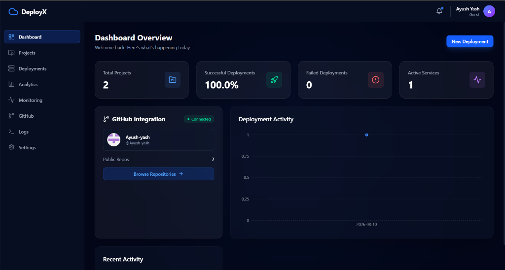
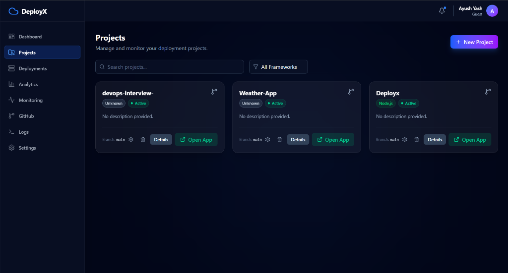
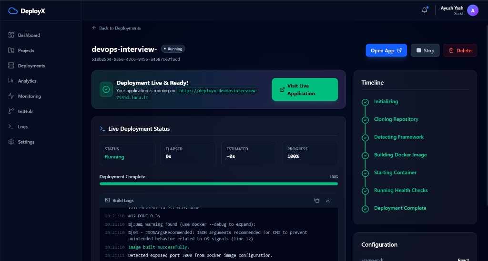

<div align="center">
  
  <h1>🚀 DeployX</h1>
  <p><strong>A Modern, Open-Source Cloud Management Platform & PaaS</strong></p>
  
  <p>
    <a href="https://reactjs.org/"></a>
    <a href="https://nodejs.org/"></a>
    <a href="https://www.docker.com/"></a>
    <a href="https://kubernetes.io/"></a>
    <a href="https://tailwindcss.com/"></a>
  </p>
</div>

<hr />

## 📍 Table of Contents

- [📖 About The Project](#-about-the-project)
- [✨ Key Features](#-key-features)
- [🏗️ Project Structure](#%EF%B8%8F-project-structure)
- [📸 Screenshots](#-screenshots)
- [🚀 Getting Started](#-getting-started)
- [🎯 How to Deploy an App](#-how-to-deploy-an-app)
- [🤝 Contributing](#-contributing)
- [📜 License](#-license)

---

## 📖 About The Project

DeployX is a powerful, self-hosted Platform-as-a-Service (PaaS) solution designed to simplify the deployment, scaling, and management of modern web applications. Think of it as your own self-hosted Vercel or Railway! 

Whether you are deploying a simple React app or a complex full-stack Kubernetes application, DeployX handles the heavy lifting of building images, managing containers, and provisioning public URLs.

## ✨ Key Features

- 🔄 **Automated Deployments:** Connect your GitHub repositories and deploy automatically on every push.
- 🐳 **Zero-Config Builds:** Powered by [Nixpacks](https://nixpacks.com/), DeployX automatically builds Docker images from source code without needing a Dockerfile.
- 🔐 **Smart Environment Variables:** Automatically discovers and injects environment variables seamlessly during build and runtime.
- ☸️ **Kubernetes Ready:** Deploy containers directly to local (Kind/Minikube) or remote Kubernetes clusters using custom manifests.
- 🌍 **Secure Cloudflare Tunnels:** Instantly generate secure, public HTTPS URLs for your deployments via Cloudflare.
- 📊 **Real-time Monitoring:** View build progress, container logs, and system metrics in real-time through WebSockets.
- 🗄️ **Database Management:** Integrated PostgreSQL provisioning and management using Prisma ORM.
- 🎨 **Modern UI:** A beautiful, responsive frontend built with React, Vite, and TailwindCSS.

---

## 🏗️ Project Structure

DeployX is built as a **Monorepo** using npm workspaces to keep the frontend and backend tightly integrated.

```text
DeployX/
├── apps/
│   ├── frontend/           # 🎨 React + Vite + TailwindCSS Dashboard
│   │   ├── src/
│   │   │   ├── components/ # Reusable UI components
│   │   │   ├── pages/      # Application routes/pages
│   │   │   └── services/   # API and WebSocket integrations
│   │   └── package.json
│   │
│   └── backend/            # ⚙️ Node.js + Express + Prisma Engine
│       ├── prisma/         # Database schema and migrations
│       ├── src/
│       │   ├── controllers/# Route handlers and business logic
│       │   ├── services/   # Docker, GitHub, and K8s integrations
│       │   └── socket.ts   # Real-time WebSocket event handlers
│       └── package.json
│
├── packages/
│   └── shared/             # 📦 Shared types and utilities across apps
│
├── package.json            # 🚀 Root configuration and scripts
└── README.md
```

---

## 📸 Screenshots

### 📊 Dashboard Overview


### 📁 Projects Management


### 🚀 Real-time Deployment Details


---

## 🚀 Getting Started

### Prerequisites

Ensure you have the following installed on your local machine:
- [Node.js](https://nodejs.org/) (v18 or higher)
- [Docker Desktop](https://www.docker.com/products/docker-desktop/) (must be running)
- [PostgreSQL](https://www.postgresql.org/) (Local or remote instance)
- [Git](https://git-scm.com/)

### 🛠️ Installation & Setup

Choose one of the following methods to run DeployX locally:

#### Option 1: Quick Start with Docker Compose (Recommended)

This is the easiest way to run the entire stack (Frontend, Backend, Database) automatically.

1. **Clone the repository:**
   ```bash
   git clone https://github.com/Ayush-yash/Deployx.git
   cd Deployx
   ```

2. **Configure Environment Variables:**
   - Copy the `.env.example` to `.env` in `apps/backend/`:
     ```bash
     cp apps/backend/.env.example apps/backend/.env
     ```
   - Open `apps/backend/.env` and setup your **GitHub OAuth App** credentials (`GITHUB_CLIENT_ID` & `GITHUB_CLIENT_SECRET`).

3. **Start the Platform:**
   ```bash
   docker-compose up -d --build
   ```
   *(This will build and spin up the React frontend, Node backend, and PostgreSQL containers concurrently)*

4. **Initialize Database Tables:**
   Once the containers are running, run the following command to push the database schema:
   ```bash
   docker exec -it cloudmanagment-backend-1 npx prisma db push
   ```

5. **Access the Platform:**
   - **Frontend Dashboard:** [http://localhost:5173](http://localhost:5173)
   - **Backend API:** [http://localhost:3000](http://localhost:3000)

---

#### Option 2: Local Development Setup (Manual)

Use this method if you want to run the services natively on your host machine.

1. **Clone the repository:**
   ```bash
   git clone https://github.com/Ayush-yash/Deployx.git
   cd Deployx
   ```

2. **Install all dependencies:**
   *(This will install dependencies for both frontend and backend workspace apps)*
   ```bash
   npm install
   ```

3. **Configure Environment Variables:**
   - **Backend:** Copy `apps/backend/.env.example` to `apps/backend/.env` and configure your **GitHub OAuth App** and `DATABASE_URL` (pointing to your local Postgres port `5433` or `5432`).
   - **Frontend:** Copy `apps/frontend/.env.example` to `apps/frontend/.env` (default is `VITE_API_URL=http://localhost:3000/api`).

4. **Initialize the Database:**
   ```bash
   cd apps/backend
   npx prisma generate
   npx prisma db push
   cd ../..
   ```

5. **Start the Platform:**
   Start both the frontend and backend servers concurrently:
   ```bash
   npm run dev
   ```

---

## 🎯 How to Deploy an App

1. **Login:** Authenticate using your GitHub account on the DeployX Dashboard.
2. **Import:** Select a repository from your GitHub account.
3. **Configure:** DeployX will automatically detect the framework and environment variables. You can customize the port or Kubernetes settings if needed.
4. **Deploy:** Click **Deploy**. Grab a coffee ☕ while DeployX clones the code, builds the Docker image, spins up the container, and provides a public HTTPS URL!

---

## 🤝 Contributing

Contributions are what make the open-source community such an amazing place to learn, inspire, and create. Any contributions you make are **greatly appreciated**.

1. Fork the Project
2. Create your Feature Branch (`git checkout -b feature/AmazingFeature`)
3. Commit your Changes (`git commit -m 'Add some AmazingFeature'`)
4. Push to the Branch (`git push origin feature/AmazingFeature`)
5. Open a Pull Request

---

## 📜 License

Distributed under the MIT License. See `LICENSE` for more information.

<div align="center">
  <i>Built with ❤️ by Ayush Yash and Contributors.</i>
</div>
